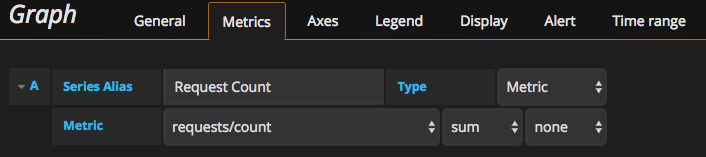
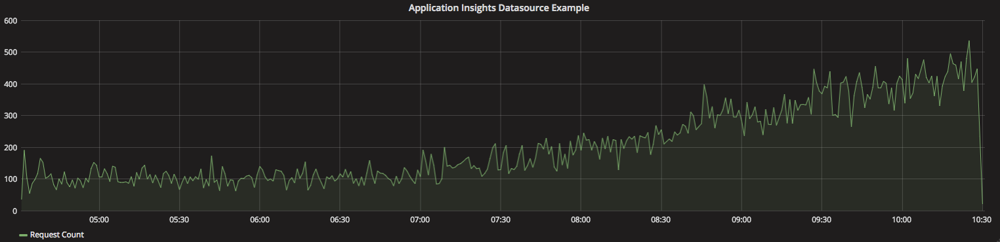
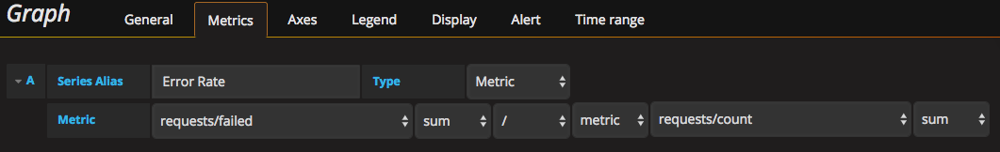
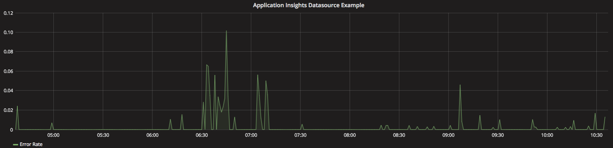
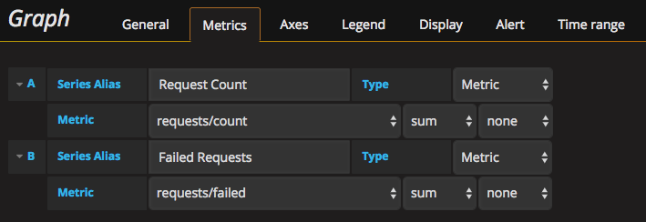
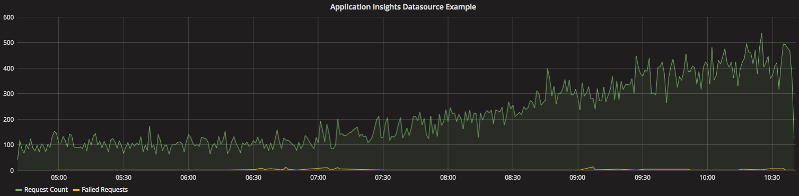
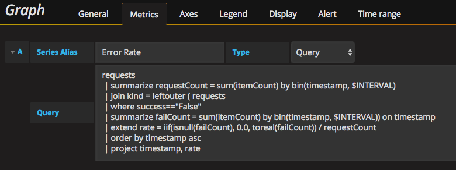
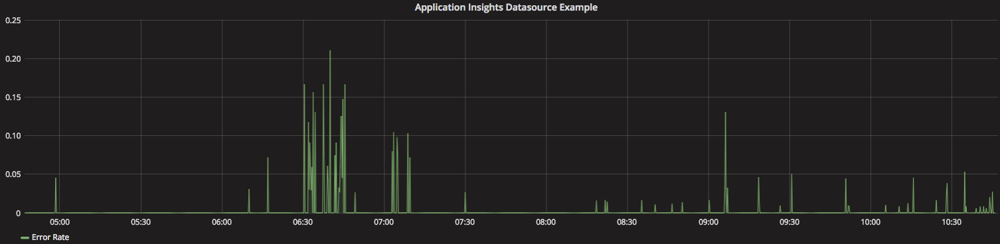

# Application Insights Datasource -  Custom Grafana Plugin
Use Application Insights Datasource plugin to integrate metrics and queries into Grafana using Azure Application Insights REST API. 

## Supported Version Information
This datasource has only been tested with Grafana Version 3.0.0-beta7 and 3.0.1 stable and higher.

## Adding the data source to Grafana

1. Add the contents of this repository to your grafana plugins directory and then restart the grafana server.
- Plugin directory: 
  - /var/lib/grafana/plugins (default)
  - /usr/local/var/lib/grafana/plugins (if installed with brew on mac)

2. Open the side menu by clicking the Grafana icon in the top header and select *Data Sources*.

3. Click the *+ Add data source* button in the top header.

4. Select *ApplicationInsights* from the Type dropdown.

5. Enter the datasource *Name*, *Application ID* and *API Key* that can be found under Configure->API Access tab in the Application Insights view for your application.

## Query editor
Open a graph in edit mode by click the *Title > Edit* (or by pressing *e* key while hovering over panel).

### Create the series alias 
- Provide meaningful *Series Alias* for the target series.

### Adding single metric to a graph
- Select *Metric* from the Type dropdown list. That indicates that you'll be quering /metrics APIs.
- Select *Metric*, and *Aggregation* from the dropdown lists.
- Set the operator to *none*.



- The query outputs a graph.



### Adding an expression based on 2 metrics to a graph
- Select *Metric* from the Type dropdown list. That indicates that you'll be quering /metrics APIs.
- Select *Metric*, and *Aggregation* from the dropdown lists.
- Choose the *Operator*. 4 operators are supported (+, -, *, /).
- Select *metric* or *constant* from the dropdown list to specify the type of the 2nd operand.
- If chosen a metric as 2nd operand type, select *Metric*, and *Aggregation* for the 2nd operand from the dropdown lists.
- If chosen a constant as 2nd operand type, type in numeric value for the 2nd operand constant.
- Provide *Series Alias* if needed.



- The query outputs a graph.



### Adding multiple series to a graph
- Add more metrics to the graph by adding another query in the panel editor. Provide meaningful aliases for clarity.



- The graph will have both metrics superimposed.



- Use *Mixed* datasource if you're trying to superimpose metrics from different datasources.

## Adding Application Insights Analytics query to a graph
- Select *Query* from the Type dropdown list. That indicates that you'll be accessing /query APIs.
- Type or paste in Application Insights Analytics query. The analytics query must return a response with the timestamp in the first column the value at that time in the second column.  If you need to rearrange or hide columns you can do so with the "project" command.  The query will use the built in Grafana time range as long as it is not overwritten in the query.  The built in Grafana time interval can be referenced within the query by using $INTERVAL.
- The following example is an Analytics query that calculates error rate by dividing the error count by the total request count:
```
requests 
 | summarize requestCount = sum(itemCount) by bin(timestamp, $INTERVAL)
 | join kind = leftouter ( requests
 | where success=="False"
 | summarize failCount = sum(itemCount) by bin(timestamp, $INTERVAL)) on timestamp
 | extend rate = iif(isnull(failCount), 0.0, toreal(failCount)) / requestCount
 | order by timestamp asc
 | project timestamp, rate
```
- Provide *Series Alias* if needed.



- The query produces a graph.

